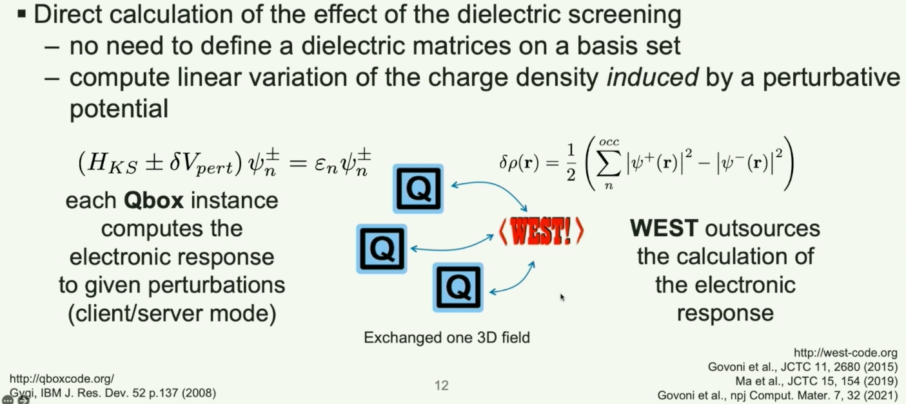
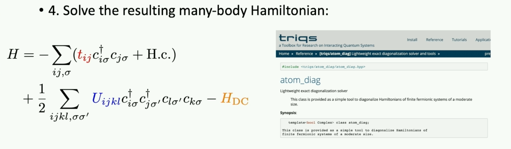
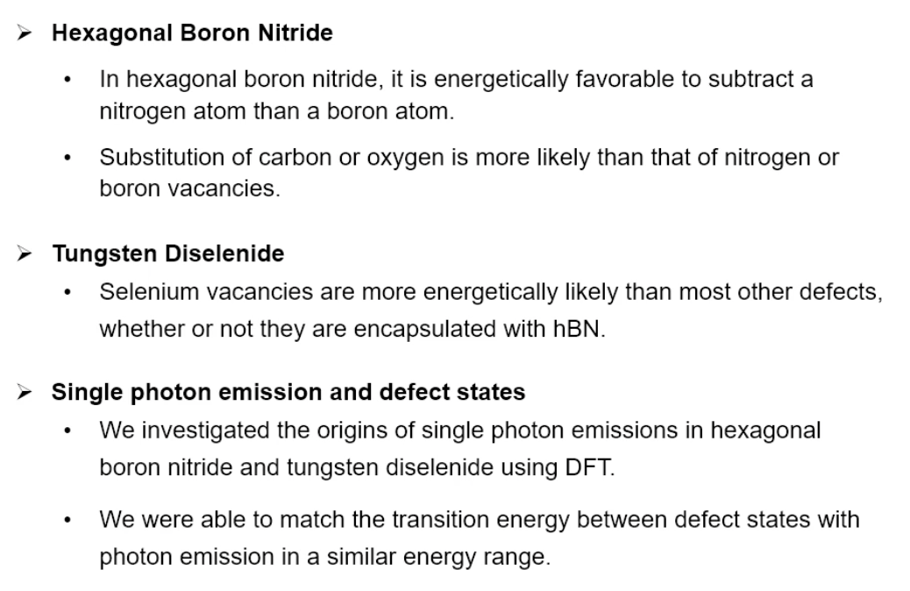

[TOC]

# APS NOTE

Three main topics are of intereat. First is the defect related research and progress and secondly are the research that related to substrate and strain effect on electronic and optical properties. Finally we look at the spin relaxation related research.

## Defect in materials(Method)

Many people recognize the single determinant level such as DFT and GW does not work for defect problems

### A43 First-Principles and Quantum Embedding Simulations for Point Defects in Semiconductors:

<a href="#top"> Back to top</a>

https://apsmarch22.onlineeventpro.freeman.com/live-stream/23877943/A43

#### Current state of Embedding techniques for Quantum Computing(Barbara A Jones)

##### 		What is Quantm embeding simulation?

Method of combining claculation of different modalities. Usually for calculating the system which consist of material system+ strong correlated or interacted sub-system (such as defect). Embeding method use medium accurate but cheat approach for the calcualtion of host material, and high accurate expensive approach for teh correlated sub-system.

##### 		Scheme of embeding region:

* Embedding region <------ MBPT or quantum computer simulation
* Rest of the region <------- usually DFT

##### 		Hybrid calculation for quantum embedding system:

**Hybrid calculation in quantum computing**: quantum computer for Embeeding region (like defect )+ Classical approach (liek DFT ) for the other region.

##### 		VQE ( The Variational Quantum Eigensolver)

calculate the energy of a Hamiltonian in Embedding region.

##### 		Some example to use Quantum computer for Embedding calculation with DFT+VQE:

The following example all use DFT+VQE to solve for the system. But use different wavefunction and embedding hamiltonian to account for the "active orbitals", where "active orbitals " means those who are of strong correlation.

* Mean field potential acount for inactive electrons; 

electron in real space split into active and inactive. Likely to be more accurate then traditional DFT. However it is not doable on current harware, and QC part is hard to converge.

https://aip.scitation.org/doi/pdf/10.1063/5.0029536

* Fragment-based embedding . 

https://arxiv.org/pdf/2109.08062.pdf

* surface defects:

  

##### Messages:

* Hybrid calculation for quantum computer can be used for defect calculation.
* How to model the Hamiltonian that can separate the active space for correlation,and how to entangle the active region with the "bath". These are the challenges need to be solved.

#### First-Principles and Quantum Embedding Simulation for Point Defects in Semiconductors

<a href="#top"> Back to top</a>

 This work focus on Optical properties calculation for defects

Contents:

##### Work1: Reformulate BSE with reducing scaling & machinine learning acceleration

* Problem: BSE need empty states--> expensive for large system

* Solution :

  1. use first equation for Absorption spectra. Use Liouville equation solve for P and E-->avoid empty states.

  

2. Calculate dielectric screening wiht finite field method:

3. For finite temperature: multiple system calculation-->machine learning train-->dielectric screening

   

##### Work2: Neutral excitaions+ lattice relaxation:  Calculate PL

* Compute PL using the **generating function approach** (see [1] in ref)

* Method to describe forces for excited states: CDFT, TDDFT

  * Triplet state -->CDFT; Singlet state and other that beyond Triplet-->TDDFT

  * Sinplet state see structure change a lot, can not use CDFT

    

##### Work3: Nertral excitation of embeded systems:

Using Quantum defect embeding theory (QDFT) to solve more accuratly than just singlet.

Coupled use of pre-exascale and quantum computer

* Workflow and codes:

  

##### Useful reference :

* Giulia's group [1]

using constrained density functional theory (CDFT) and time-dependent hybrid DFT perform equally well in describing the excited state potential energy surface of triplet states

 https://journals.aps.org/prmaterials/abstract/10.1103/PhysRevMaterials.5.084603 (Giulia Galli's)

Using DMRG method for defect correlations

 

https://arxiv.org/pdf/2203.05493.pdf

Use quantum embedding theory for Strong correlation of defects:

https://arxiv.org/abs/2105.04736

Exact double counting scheme for QDET (K46.0004)

https://arxiv.org/abs/2203.05493

* Cyrus E. Dreyer:

We implement such an embedding method, based on Wannierization of defect orbitals and the constrained random-phase approximation approach. This paper use CBCN and NV- as an example.

https://arxiv.org/pdf/2105.08705.pdf

* PyCCE: new package for simulating the dynamics of spin qubits in a spin bath

https://onlinelibrary.wiley.com/doi/10.1002/adts.202100254

* Formation energy of divacanvy in SiC:

https://www.nature.com/articles/s41467-021-26419-0

##### related work:

* 1st princople simulation of defects Spin properties (G39.00005)
* Thermodynamical properties of defects (W72 0002, 0007)
* Using TDDFT for vibrationally resolved absorption spetra between singlet states (T46.00011, Yujin)
* An exact double counting scheme for QDET (quantum embeding )

#### Computational spectroscopy for point defects (Cyrus E Dreyer)

<a href="#top"> Back to top</a>

This talk will discuss several examples of recent theoretical developments for : (i) improving the general quantitative accuracy of the methods, (ii) increasing the range of defect properties that can be addressed, and (iii) including aspects that make calculations more directly comparable to experiment

##### Works:

* Non-radiative rate calculation+ stron el-pho interaction (exfiton ignored)
* Quantum embedding theory:

##### Useful references:

Quantum embedding for defects

* Adam Gali:

  We provide a complete quantitative description of the electronic structure and analyze the crossings and local minima of the energy surface of triplet and singlet states.

  https://www.nature.com/articles/s41535-018-0103-6

* Galli group, He Ma

  * present first-principles calculations of strongly correlated states of spin defects in diamond

  https://pubs.rsc.org/en/content/articlelanding/2020/CP/D0CP04585C#!divAbstract

  * present a quantum embedding theory for the calculation of strongly-correlated electronic states of active regions, with the rest of the system described within density functional theory

  https://www.nature.com/articles/s41524-020-00353-z

  * We present a detailed derivation of a quantum embedding theory recently introduced, which is based on the definition of effective Hamiltonians. The effect of the environment on a chosen active space is accounted for through screened Coulomb interactions evaluated using density functional theory

  https://pubs.acs.org/doi/10.1021/acs.jctc.0c01258

  * K46 An Exact Double Counting Scheme for Quantum Defect Embedding Theory(Galli)

    Gulia Galli group work for solving the souble counting problem.

    https://arxiv.org/abs/2105.04736

* Dreyer (this work)

  using DFT to describe the bulk host material. We implement such an embedding method, based on Wannierization of defect orbitals and the constrained random-phase approximation approach.

  sysmte: CBCN, NV-,  Al site in wurtzite AlN (FeAl)

  https://arxiv.org/abs/2105.08705

#### Theoretical magneto-optical spectroscopy of solid state defect quantum bits (Adam Gali)

Embeding approach:

* Jahn-Teller effect and intersystem crossing for NV center

* DMRG method for correlation

  

* gCCE3 theory of T2 evaluation:

  

### B67 Advanced Approaches in Modeling and Simulation of Defects (0001,0005)

<a href="#top"> Back to top</a>

No video yet

* 0001: new computational approach

  developing computational approaches for the first-principles prediction of the defect and doping properties in highly nonideal semiconductor materials

* 0005: machine learning to accelerate defect finding :

  *combining high-throughput density functional theory (DFT) with machine learning (ML) to develop predictive models for defect formation energy and charge transition levels in (a) ABX3 halide perovskites, and (b) zincblende group IV, III-V and II-VI semiconductors*

## Defect in materials (New defects proposed)

<a href="#top"> Back to top</a>

#### First-principles predictions of out-of-plane group IV and V dimers as high-symmetry high-spin defects in hexagonal boron nitride (Marco Govoni)

https://pubs.acs.org/doi/abs/10.1021/acsami.1c16988

we combine density functional theory (DFT) and quantum embedding theories (QET), find new group of high-symmetry, hi-spin defect in hBN

##### Method:

QE+ONCV+Dielectric-dependent hybrid functionals

##### Finding:

* Caculated formation energy, HR factor , ZPL, Zero-field splitting.
  * formation energy -->stable
  * $Si_N Si_i^-$ have HR=4.47, small-->visible sharp at low T
  * $Si_N Si_i^-$  have 2.4 GHz ZFS, prefered for ODMR control

#### Unconventional defect configurations in aluminum oxide

<a href="#top"> Back to top</a>

They use 3 statistic method to idensify defects.

#### D67 Defects in Nitride Materials: New types of defect proposed 

<a href="#top"> Back to top</a>

III-nitride semiconductors (GaN, AlN, InN) and their alloys have enabled tremendous progress in a range of applications from wide-bandgap (WBG) power electronics to light-emitting devices. 

#### K67 First principle study on optical properties of defects in two-dimensional materials

<a href="#top"> Back to top</a>

DFT, HSE06, BSE, GW and Formation energy for defects in hBN and WSe2

#### T72 Extrinsic and Intrinsic Defects in MgO and CaO as potential spin-qubit candidates

cDFT, DFT. 

DFT+U.

Strong correlation discussed.

#### T72 Beryllium oxide as a host for quantum defects

<a href="#top"> Back to top</a>

#### Others(no video):

K67 Excited-state spin-resonance spectroscopy of VB- defects in hexagonal boron nitride

K67 Theory of substitutional carbon defects in hexagonal boron nitride

## Substrate and strain effects

#### Influence of substrates on properties of defect-based quantum emitters in hexagonal boron nitride (B72.00006)

<a href="#top"> Back to top</a>

They calculated ZPL for NBVN and VN on SiO2;

**reason of the change of ZPL, intrinsically still due to lattice distortion, which we did not included in our substrate calculation** So our result still proved only lattice distortion will cause the optical energy shift, while pure dielectrc change does not affect the optical energy.

#### G55 Dielectric and substrate engineered tuning of photoluminescence in monolayer WS2

<a href="#top"> Back to top</a>

Study exciton for WS2/SiO2. How separation between the material and substrate affect the the optical properties. 

method: insert hBN between to increase the separation.

no video yet

#### G67 Optical responses of boron-vacancy defects in strained hexagonal boron nitride

<a href="#top"> Back to top</a>

we report first-principles calculation of electronic band structures and optical absorption spectrum of VB and VB- single point defects in monolayer h-BN under external strain.

* Calculation detail:
  * VASP +LDA
  * 9 9 1 supercell; 15 A vacuum
  * 1 1 1 k points

they discussed the zero field splitting, breaking of symmetry due to JT distortion

#### Y48 Substrate effects on the properties of few-layer MoS2 and the MoS2/WS2 heterostructure from first-principles GW

https://apsmarch22.onlineeventpro.freeman.com/sessions/23878776/subsession/33046479/Y48

(no video)

we focus on the effect of two commonly used substrates in experiments – hexagonal boron nitride and gold – on three systems: monolayer MoS2, bilayer MoS2, and the MoS2/WS2 heterostructure

first-principles dielectric embedding GW to capture the dielectric effect of the substrate

**They also use chi sum method. Only studied electronic structure.**

#### Y48 Electronic and Optical Properties of monolayer boron nitride on a graphite substrate

https://apsmarch22.onlineeventpro.freeman.com/sessions/23878776/subsession/33046486/Y48

(no video)

monolayer boron nitride (mBN) grown on Highly Ordered Pyrolytic Graphite (HOPG) substrate based on density functional theory and many-body perturbation theory

we find a **huge reduction of exciton binding energy in the presence of HOPG substrate and a blue-shifting of the 1s-exciton energy to above 6 eV** (This is too large)

we demonstrate that strong electron–phonon interactions also play an important role in the optical process of mBN and give rise to the multiple phonon sidebands as observed from photoluminescence measurements. As a result, we propose that both the strong dielectric screening from the substrate and the strong electron–phonon interaction must be explicitly included to the analysis of luminescence measurements

## Calculation method

#### G66 Efficient GW calculations in two dimensional through the interpolation of the screened potential

<a href="#top"> Back to top</a>

Solve the sampling converge problem when there's a sharp dielectric functin around q->0 limit. (like graphene)

 improve the convergence of the QP corrections of 2D semiconductors with respect to the q-sampling, by combining Monte Carlo integration techniques and interpolation schemes of the screened potential.

#### K46 Phonon-assisted luminescence in qubits from many-body perturbation theory

<a href="#top"> Back to top</a>

Method to include the electron-phonon interaction in PL within a rigorous many-body perturbation theory framework.

Study model: negatively-charged boron vacancy in 2D hexagonal boron nitride

We show that phonons are responsible for the observed luminescence, which otherwise would bedark due to symmetry. We also show that the symmetry breaking induced by the static Jahn-Teller effect is not able to describe the presence of the experimentally observed peak at 1.5 eV. 

## Spin relaxation

#### G39 Simulations of Spin Qubit Dynamics Made Simple (Galli)

<a href="#top"> Back to top</a>

https://onlinelibrary.wiley.com/doi/10.1002/adts.202100254

proposed a python library for first-principles calculations of qubits’ coherence---PyCCE (release in a month)

simulating the dynamics of spin qubits in a spin bath using the cluster-correlation expansion (CCE) method

* calculation sample: 
  * Hahn-echo coherence time of the nitrogen-vacancy in diamond; 
  * the calculation of the coherence time of the basal divacancy in silicon carbide at avoided crossings; 
  * the calculation for magnetic field orientation-dependent dynamics of a shallow donor in silicon

#### K37 Ensemble spin relaxation studies of shallow donor qubits in ZnO

<a href="#top"> Back to top</a>

Ref we used for T1 project.

Spin relaxation,Kai-Mei C Fu

In previous work, we have demonstrated optical spin initialization, spin relaxation times (T1) of 140 μs, spin-echo coherence times (T2) of 50 μs and narrow inhomogeneously broadened linewidths of ≈25 GHz 

https://journals.aps.org/prapplied/abstract/10.1103/PhysRevApplied.10.064061

Their paper: https://arxiv.org/pdf/2111.11564.pdf

Substituting Zn with Al, Ga or In. we call the substituted : donor; 

$B^5$ dependency at B>3T

#### M46  Novel First-Principles Tools for Electron Dynamics in Quantum Materials and Devices (Marco Bernadi)

<a href="#top"> Back to top</a>

Methods to accurately predict spin relaxation and defect-mediated scattering, of relevance for quantum devices

conclude by highlighting progress on our open-source code, PERTURBO

(no video)

 https://arxiv.org/pdf/2203.06401.pdf

#### W46 Calculating Phonons within the FLAPW Method using Density Functional Perturbation Theory (DFPT)

<a href="#top"> Back to top</a>

we present our implementation of the DFPT approach within the FLAPW method, encoded in the FLEUR code.

This is a code work on calculating phonon dispersion [www.flapw.de](http://www.flapw.de)

#### W46 Electron spin decoherence due to phonons: Unified many-body framework and first-principles calculations

<a href="#top"> Back to top</a>

present a unified many-body approach for s-ph decoherence, which encompasses both the EY and DP mechanisms

https://apsmarch22.onlineeventpro.freeman.com/sessions/23878708/subsession/33045690/W46

(no video yet)

#### Y36 Scaling Spin Coherence in Solid-state Defect Qubit

<a href="#top"> Back to top</a>

Use CCE(cluster correlation expansion ) calculation for spin coherence time T2 calculation

Decouple the contributions from different spin bath from various elements

### Other that have no video yet:

<a href="#top"> Back to top</a>

 Excited State VII: 2D materials and quantum materials

#### Y48 First-principles calculations of excitons in 2D: photoemission spectra, relaxation dynamics, and magnetic effects

valley- and spin-selective excitonic energy relaxation pathway, which leads to novel ultrafast dynamics and the discovery of selection rules for exciton-phonon couplings

https://apsmarch22.onlineeventpro.freeman.com/sessions/23878776/subsession/33046478/Y48

No video yet

#### Y52 First-principles prediction of long spin lifetimes in materials with uniform internal magnetic fields

https://apsmarch22.onlineeventpro.freeman.com/sessions/23878780/subsession/33046530/Y52

(No video yet)

We show that a wide class of hybrid perovskite materials exhibit near-perfect uniformity in the direction of the internal magnetic field, which is known to strongly suppress DP spin relaxation. Using a first-principles density-matrix framework for predicting spin relaxation in a wide class of materials, we computationally demonstrate increased spin life times in these materials. Finally, we investigate the impact of additional symmetry breaking, such as chirality, on the spin dynamics in such materials. 

#### Y52 Ab initio calculation of T2 using Lindbladian dynamics

https://apsmarch22.onlineeventpro.freeman.com/sessions/23878780/subsession/33046531/Y52

(No video yet)

Using a recently-developed first-principles Lindbladian density-matrix simulation framework, we directly simulate Hahn spin echo measurements to extract T2 in exactly the same way as in experiments

Ravishankar Sundararaman